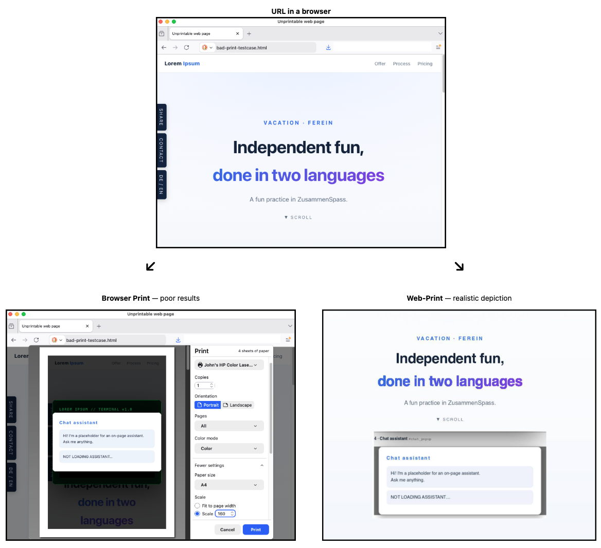

# Web-Print as a Claude Code Skill
[](LICENSE)

*It's not secure if it can't be printed — because there's no audit trail.*

**Audience**: Humans and Claude bots alike.<br/>
This repository illustrates deploying and running a Python script as a Claude **Skill**, then<br/>
&nbsp; &nbsp; distributing that skill in two ways — a **ZIP-edition Skill** and a **Plugin-edition Skill**.

**Web-Print** is a Python script to "fix" unprintable web sites by patching a copy of the HTML.

<p align="center">
  
</p>

<br/>

## 1. Overview

**Web-Print** is a Python script to "fix" unprintable web sites by patching a copy of the HTML.<br/>
You can run the Python fix-it script directly on your laptop / computer; see below.

But it's more convenient to run this directly as a **Claude Code** skill,<br/>
&nbsp; &nbsp; especially from the Desktop App, rather than from the CLI terminal edition.

<details>
<summary>Script summary</summary>

The script does two things, and both happen where the script runs:

1. **URL Fetch** the target web site — a network request.
2. **Render** it with a headless browser, eg Playwright's Chromium,<br/>
   or using an existing Chrome browser via the `--chromium` option.

**Disclaimer**<br/>
As of this writing (July 2026), Anthropic documents the installation process of Skills and Plugins with<br/>
&nbsp; &nbsp; *DevOps-style Bash commands* like `$ mkdir -p ~/.claude/skills/summarize-changes`.

In this document, I emphasize asking Claude itself to perform the necessary installation steps.<br/>
This generally works well, but it's relatively new to Anthropic's mindset and there may be some rough edges.

</details>

### 1A. Claude Code
A **Claude Code skill** runs this fix-it script locally on your computer,<br/>
&nbsp; &nbsp; handling the installation steps and prerequisites for you.

The **URL Fetch** comes from your own computer, to the remote site, acting on your behalf.

<details>
<summary>Other editions, versions, platforms, and output (click to expand)</summary>

### 1B. Claude Chat & Claude Cowork

Although **Claude Chat** (aka "Claude.ai web") and **Claude Cowork** can also run this skill,<br/>
&nbsp; &nbsp; this often fails to work — because the running location is in an Anthropic cloud sandbox.

This means, the **URL Fetch** appears as a "bot scrape" if it gets to the target web site, but it's<br/>
&nbsp; &nbsp; often blocked either at the source (by Anthropic egress), or destination (eg, by CloudFlare).

However, **Web-Print** can also read data directly from HTML files, so if this is your use-case,<br/>
&nbsp; &nbsp; running the skill from **Claude Chat** or **Claude Cowork** should succeed.

This document does not describe **Chat** or **Cowork** further.<br/>
Everything below targets **Claude Code**; aficionados are welcome to try other editions themselves.

### 1C. Claude versions

In this project, I used **Claude Opus 4.8**, with the personal paid "Max plan", in June 2026.<br/>
Other editions probably work too, but this was not tested — and it's a moving target.

### 1D. Platforms

These Claude instructions are tested and working on **MacOS** and **MS-Windows 11** computers.<br/>
The Python script alone also works on **Linux Ubuntu** and **WSL** (Windows Subsystem for Linux).

### 1E. Output

When run locally, the resulting PDF files are stored locally on your computer.<br/>
The skill output will display the location when done.

</details>

<br/>

## 2. Install or Upgrade the ZIP-edition Skill

### 2A. Overview
A skill is a set of instructions — packaged as a simple folder —<br/>
&nbsp; &nbsp; that teaches Claude how to handle specific tasks or workflows.

Skills are one of the most powerful ways to customize Claude for your specific needs.

### 2B. Ask Claude to do it
A simpler way is to ask Claude to install the skill, and click "allow" each time when asked.<br/>
When done, ask Claude if a restart is needed.<br/>
Copy / Paste this text into a **Claude Code prompt**:

<details>
<summary>The install and upgrade prompts — Desktop App and CLI (click to expand)</summary>

```
Install the Web-Print Skill from its ZIP file, or upgrade (replace) the existing Skill.

1. Review the README:
https://raw.githubusercontent.com/John-D-B/web-print/main/README.md

2. Install the skill:
https://raw.githubusercontent.com/John-D-B/web-print/main/skills/web-print.skill
```

Claude downloads the Skill bundle, unzips into `~/.claude/skills/`<br/>
&nbsp; &nbsp; and runs the prerequisite installations if/as needed:
- Python
- Python modules
- Chromium

An upgrade replaces the previous version rather than merging with it, so a fresh<br/>
&nbsp; &nbsp; Claude session may be needed before the new version takes effect.

Any installation problems — like permission denied, or out of disk space — will be clearly indicated.

</details>

### 2C. FYI: Inside the Skill file

<details>
<summary>The .skill file's contents (click to expand)</summary>

```bash
$ unzip -l web-print.skill 
Archive:  web-print.skill
  Length      Date    Time    Name
---------  ---------- -----   ----
    13199  07-09-2026 18:51   web-print/SKILL.md
        6  07-09-2026 18:17   web-print/version.txt
     1466  07-05-2026 15:25   web-print/LICENSE.txt
     1092  07-02-2026 10:29   web-print/scripts/requirements.txt
    58951  07-09-2026 18:45   web-print/scripts/web-print.py
---------                     -------
    74714                     5 files
```

</details>

### 2D. Test the Claude Skill: Info

Compare your browser's **Print to PDF** of a web site, with the PDF results from **Web-Print**.

<details>
<summary>Info commands (click to expand)</summary>

- In a **Claude Code prompt**, ask the skill to show basic information:<br/>
```
skill web-print version
skill web-print help
skill web-print license
```

</details>

### 2E. Test the Claude Skill: Claude Code
*Both **URL Fetch** and **FILE Fetch** work correctly.*

<details>
<summary>Example commands (click to expand)</summary>

```
skill web-print https://en.wikipedia.org/wiki/PDF   --overlay all
skill web-print https://raw.githubusercontent.com/John-D-B/web-print/main/tests/bad-print-testcase.html
skill web-print .../tests/bad-print-testcase.html   # - Supply a correct file path.
```

</details>

### 2F. Official guidelines
<https://resources.anthropic.com/hubfs/The-Complete-Guide-to-Building-Skill-for-Claude.pdf>


<br/>

## 3. Install or Upgrade the Plugin-edition Skill

*This introduces Anthropic Marketplace as a technical concept; this repository is a "local" market for Web-Print.*<br/>
*This is the recommended approach.*

### 3A. Overview

A plugin is a bundle that carries one or more skills; here it carries the web-print skill.<br/>
You add this repository as a marketplace, then install it.

<details>
<summary>How the two editions coexist, and CLI vs Desktop App (click to expand)</summary>

This **Plugin-edition Skill** is a **separate instance** from the **ZIP-edition Skill**<br/>
A different invocation name is used: `/johnb-plugins:web-print`

Both editions can exist at the same time in Claude, invoked differently.<br/>
To switch using only one Skill edition, just ask Claude to uninstall the other one — described below.

**Claude Code CLI** vs **Desktop App**<br/>
Claude Code comes in two forms, and they differ for *installing* a plugin:

- The **Desktop App** — the "Code" tab — *runs* skills and plugins once they are installed,<br/>
&nbsp; &nbsp; but has **no `/plugin` command** of its own, so it cannot add a marketplace or install.<br/>
&nbsp; &nbsp; However, it can spawn `$ claude plugin …` Bash commands as needed.<br/>
The Desktop App depicts Claude Code as an orange "flashing starburst" icon: &nbsp;
<br/>
***Desktop App** is the recommended approach.*

- The **CLI** — the terminal `claude` command — carries the `/plugin` slash-commands and<br/>
&nbsp; &nbsp; the `claude plugin …` Bash commands, i.e. the whole marketplace machinery.<br/>
The CLI depicts Claude Code as an orange "Space Invader" icon: &nbsp;


Both forms read the same `~/.claude/plugins/` store, so a plugin the CLI installs is picked<br/>
&nbsp; &nbsp; up by the Desktop App after a restart. That is why the steps below go through the CLI<br/>
&nbsp; &nbsp; even when you mean to drive the skill from the Desktop App — and why the paste-prompt<br/>
&nbsp; &nbsp; asks Claude to set up the CLI first if it is missing.

</details>

### 3B. Ask Claude to do it

Ask Claude Code to install the skill, and click "allow" each time when asked.<br/>
When done, ask Claude if a restart is needed.<br/>
Copy / Paste this text into a **Claude Code prompt**, based on the form.

<details>
<summary>The install and upgrade prompts — Desktop App and CLI (click to expand)</summary>

**Claude Code** in the **Desktop App** (recommended)
```
Claude, please review this project's README, prepare for installation:
https://raw.githubusercontent.com/John-D-B/web-print/main/README.md

Claude, I want to install the "johnb-plugins" plugin (it provides the web-print skill)
from https://github.com/John-D-B/web-print.git .

This Desktop App has no /plugin command, so please install it through the Claude Code CLI:

1. Check whether the "claude" command is on PATH.
    If not, then run steps 2a - 2b. If yes, then skip to step 3.

2a. If "npm" is missing: Install "Node.js":
    Use winget on Windows, or the Node installer.

2b. If "claude command" is missing: Install the Claude Code CLI:
    $ npm install -g @anthropic-ai/claude-code

3. Run these Bash/PowerShell commands:
    $ claude plugin marketplace add https://github.com/John-D-B/web-print.git
    $ claude plugin install johnb-plugins@john-d-b

4. Confirm:
    $ claude plugin details johnb-plugins@john-d-b

5. Then tell me whether I must restart the Desktop App for the plugin to appear.
```

**Claude Code** in the **CLI**
```
Claude, please review this project's README, prepare for installation:
https://raw.githubusercontent.com/John-D-B/web-print/main/README.md

/plugin marketplace add https://github.com/John-D-B/web-print.git
/plugin install johnb-plugins@john-d-b
```

### Upgrades

**Claude Code** in the **Desktop App** 
```
Claude, please review this project's README, prepare for an upgrade:
https://raw.githubusercontent.com/John-D-B/web-print/main/README.md

Then upgrade the "johnb-plugins" plugin through the Claude Code CLI:

1. Refresh this repository's marketplace catalog:
    $ claude plugin marketplace update john-d-b

2. Update the plugin to the latest version:
    $ claude plugin update johnb-plugins@john-d-b

3. Then tell me whether I must restart the Desktop App for the new version to take effect.
```

**Claude Code** in the **CLI**
```
Claude, please review this project's README, prepare for an upgrade:
https://raw.githubusercontent.com/John-D-B/web-print/main/README.md

/plugin marketplace update john-d-b
/plugin update johnb-plugins@john-d-b
```

On its first session after install, the plugin installs its own Python and Chromium dependencies.<br/>
This is done with the internal, system-independent `bootstrap.py` Python script.

</details>

### 3C. FYI: Inside the Plugin structures

The plugin is a **bundle** (`johnb-plugins`) whose one component is the<br/>
&nbsp; &nbsp; **web-print** skill. Its layout in this repository:

<details>
<summary>Plugin file layout, and inspect commands (click to expand)</summary>

```
plugins/johnb-plugins/
├── .claude-plugin/
│   └── plugin.json          the plugin manifest (name, version)
├── hooks/
│   └── hooks.json           runs bootstrap.py once, on first session
├── bootstrap.py             installs Python + Chromium dependencies
└── skills/
    └── web-print/
        ├── SKILL.md         the skill itself
        └── scripts/         web-print.py + requirements.txt
```

The repository root also carries `.claude-plugin/marketplace.json` — the catalog<br/>
&nbsp; &nbsp; that lists this plugin, so `/plugin marketplace add` can find it.

You can inspect a marketplace or plugin without installing anything.

**Claude Code** in the **CLI**
```bash
/plugin validate .     # validate the plugin/marketplace in the current directory
/plugin                # open the manager, then: Installed tab → a plugin → details
```

**Bash commands:**
```bash
$ claude plugin validate .                          # run from the repo root
$ claude plugin details johnb-plugins@john-d-b      # after it is installed
```

</details>

### 3D. Test the Claude Skill: Info

Compare your browser's **Print to PDF** of a web site, with the PDF results from **Web-Print**.

<details>
<summary>Two ways to invoke it, with examples (click to expand)</summary>

There are two ways to reach the skill from a Claude prompt, worth knowing when you<br/>
&nbsp; &nbsp; have both the **ZIP-edition** and **Plugin-edition** Skills installed:

- **`skill web-print …`** — the skill's own command grammar; reaches whichever<br/>
&nbsp; &nbsp; Skill edition is present. Caution: This can be ambiguous when both Skill editions are installed.

- **`/johnb-plugins:web-print`** — the **Plugin-edition Skill**'s explicit namespaced handle;<br/>
&nbsp; &nbsp; targets the **Plugin-edition Skill** unambiguously, even with both installed.

**Skill-native** syntax:
```
skill web-print version
skill web-print help
skill web-print license
```

Alternate, to ensure using the non-Plugin edition Skill, if both are installed:
```
skill anthropic-skills:web-print version
```

**Plugin** syntax:<br/>
*This **Claude Code** syntax works both in the Desktop App and the CLI.*
```
/johnb-plugins:web-print version
/johnb-plugins:web-print help
/johnb-plugins:web-print license
```

</details>

### 3E. Test the Claude Skill: Claude Code
*Both **URL Fetch** and **FILE Fetch** work correctly.*

<details>
<summary>Example commands (click to expand)</summary>

```
skill web-print https://en.wikipedia.org/wiki/PDF   --overlay all
skill web-print https://raw.githubusercontent.com/John-D-B/web-print/main/tests/bad-print-testcase.html
skill web-print .../tests/bad-print-testcase.html   # - Supply a correct file path.
```

</details>

### 3F. Official guidelines
<https://claude.com/docs/plugins/overview><br/>
<https://code.claude.com/docs/en/plugins><br/>
<https://github.com/anthropics/skills>

<br/>

## 4. Alternate Script-Only Installation

<details>
<summary><em>This describes how to manually install just the Python script itself, outside of Claude.</em><br/>
<em>This runs entirely on your own computer — free, with no API tokens and no per-use cost.<br/>
&nbsp; &nbsp; Good for high-volume use, or anyone who'd rather not pay for Claude Code at all.</em></summary>

### 4A. Ecosystem
Ensure your computer already has these items installed:

- `Python3` ,  `pip`
- Python `venv` is optional, supported, and encouraged.
- `Git` tools

These are standard in modern Bash environments on MacOS, Linux, & WSL,<br/>
&nbsp; &nbsp; but may require explicit steps in Microsoft PowerShell.

The instructions here are for Bash shells (MacOS, Linux, WSL).<br/>
Similar commands also work in Microsoft PowerShell, but not described here.

### 4B. Clone the GitHub repository onto your computer
```bash
$ mkdir -p ~/repositories/
$ cd       ~/repositories/
$ git clone https://github.com/John-D-B/web-print.git
$ cd       ~/repositories/web-print/
```

*Optional but encouraged — create and activate an isolated environment:*
```bash
$ python3 -m venv .venv
$ source .venv/bin/activate
```

### 4C. Install the prerequisites
```bash
# - Info:
$ cat bin/requirements.txt

# - Installation
$ pip install -r bin/requirements.txt
$ python3 -m playwright install chromium
```

### 4D. Test the Script
```bash
$ python3 bin/web-print.py --help
$ python3 bin/web-print.py ./tests/bad-print-testcase.html
$ python3 bin/web-print.py https://en.wikipedia.org/wiki/PDF
```

The script will produce two editions of "fixed" PDFs, and launch a viewer.

</details>

<br/>

## 5. Uninstall

<details>
<summary>Uninstall either edition — ask Claude, or the manual commands (click to expand)</summary>

The two Skill editions uninstall by **different mechanisms**, so name the target precisely;<br/>
&nbsp; &nbsp; a fresh Claude session has no memory of installing anything,<br/>
&nbsp; &nbsp; and the plugin's name (`johnb-plugins`) is not the skill's name (`web-print`).

- **Plugin-edition Skill** — a clean, one-command uninstall.
- **ZIP-edition Skill** — there is no uninstall command; it is a folder to delete:<br/>
&nbsp; &nbsp; Claude  Code: `~/.claude/skills/web-print/`

Copy / Paste this text into a **Claude Code prompt**, in either form: Desktop App or CLI.<br/>
Then start a fresh Claude session after an uninstall, to avoid confusing Claude sessions.
```
Claude, please uninstall the Plugin-edition Web-Print Skill — the "johnb-plugins" plugin.
Claude, please uninstall the ZIP-edition Web-Print Skill — the one installed directly from the ZIP, not the plugin.
```

FYI: Explicit manual uninstall commands:

```bash
$ claude plugin uninstall johnb-plugins@john-d-b     # Plugin-edition Skills, or "/plugin uninstall" in the CLI
$ rm -rf ~/.claude/skills/web-print/                 # ZIP-edition Skills: just a folder to delete
```

</details>

<br/>

## 6. License

**Web-Print** is dual-licensed:

- **Source-available** under the **Business Source License 1.1 (BSL)** —<br/>
&nbsp; &nbsp; free to use (including for paid client work), modify, and self-host.<br/>
&nbsp; &nbsp; Each version converts to open source (GPL) four years after release.<br/>
&nbsp; &nbsp; Full text: `LICENSE`.
- **Commercial license** — required only to offer **Web-Print** itself as a<br/>
&nbsp; &nbsp; commercial product or service (hosted, embedded, or resold).

See `LICENSING.md` for the plain-English summary of both options,<br/>
&nbsp; &nbsp; and `CONTRIBUTING.md` if you would like to contribute.

Copyright © 2026, Mountain Informatik GmbH. Original software by John Buehrer.

<br/>

## 7. Future Enhancements

For consideration:

1. **Wider coverage.**<br/>
Handle additional malformed HTML constructions, beyond the overlays,<br/>
&nbsp; &nbsp; sticky bars, and consent walls that Web-Print already mitigates.

2. **A browser extension.**<br/>
Recode Web-Print as a browser extension, for a more integrated experience —<br/>
&nbsp; &nbsp; fix-and-print without leaving the page.

<br/>

## 8. Credits

**Author**: John Buehrer (JohnB), with AI pair-programming support by Anthropic Claude Code<br/>
**Date**:  Saturday 04. July 2026
